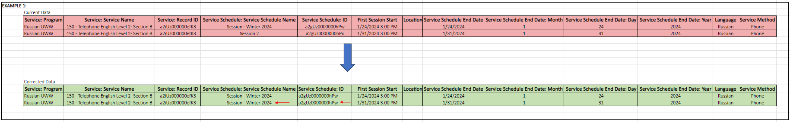

#### Introduction:
Due to Data Migration from custom tables to Salesforce's PMM environment, the data lost correct format and hierarchical structure. Specifically, the hierarchical relationship between Services and Service Sessions was corrupted. Service Sessions were mistakenly saved with unique Service Schedules, rather than associating multiple sessions of the same Service with a single Service Schedule window.  A Service Schedule window is defined by Month and Fiscal Year, meaning Sessions of the same Service that took place in the same month and year should have the same Schedule ID. 

#### Representation of the Problem in Data

The Attributes (columns) of the original table:

| **Column Name**                         | **Description**                               |
| :-------------------------------------- | --------------------------------------------- |
| Service: Program                        | Program Name                                  |
| Service: Service Name                   | Service Name                                  |
| Service: Record ID                      | *unique identifier of services*               |
| Service Schedule: Service Schedule Name | Name for service schedules                    |
| Service Schedule: ID                    | *unique identifier of service schedule*       |
| First Session Start                     | Date of First Session of the Service          |
| Location                                | Where the Service  took place                 |
| Service Schedule End Date               | Date of the Final Day of the Service Schedule |
| Language                                | Language Service was given in                 |
| Service Method                          | Method of Service                             |

The original data reveals an incorrect hierarchical relationship where sessions of the same Service are associated with unique Service Schedules. Sessions of the same service that occurred within Month and Year *should* have the same Service Schedule ID.

**Example 1:**

The service `150 - Telephone English Level 2 - Section B` from the `Russian UWW` Program is identified by Service Record ID `a2iUz000000efK3`. This service was provided twice on January 24, 2024, and January 31, 2024. 
Both sessions should belong to the same Service Schedule since they occurred in the same schedule window of January 2024. However, as shown in the original data, they have unique Service Schedule IDs.
In the corrected data, both sessions now have the same Service Schedule ID, indicating they are part of the same Service Schedule, January 2024.  


#### Solution 
To correct the data:
1. **Identify Rows:** Identify rows that should have the same schedule ID by *grouping* sessions of the same service occurring in the same month and year.
2. **Update Data:** Update the schedule ID and schedule name to ensure these rows have the same schedule ID and schedule name.

#### The Code
Code Implementation: We implemented the solution using Python including the library *Pandas*, a library that helps manipulate and analyze data. 

```
# Import Libraries
import pandas as pd
from openpyxl import load_workbook
import os

# Get the directory of the current python file
script_dir = os.path.dirname(os.path.abspath(__file__))

# Define the folder containing the workbook as the same directory as the script
folder_path = script_dir


# List all Excel files in the folder
files = [f for f in os.listdir(folder_path) if f.endswith('.xlsx')]

  
# Check if there is exactly one Excel file
if len(files) != 1:
    raise FileNotFoundError("There should be exactly one Excel file in the folder.")
  
# Get the path to the single workbook
workbook_name = files[0]
workbook_path = os.path.join(folder_path, workbook_name)
print(f"Program is using workbook: {workbook_name}")
print("Program Running...")

'''
Data Correction Project Begins:
'''
# Import Workbook:
book = load_workbook(workbook_path)
  
# Convert Sheet with Original Data into pandas DataFrame
original_dataFrame = pd.read_excel(workbook_path, sheet_name=0)

'''
Group original data based on the Month and Year the service occured using the Date in column 'First Session Start'
using pandas to_period() function
'''

# Convert Dates into type datetime
original_dataFrame['First Session Start'] = pd.to_datetime(original_dataFrame['First Session Start'], format='%m/%d/%Y %I:%M %p')

# Creating new Column named Period to 'extract' the Month and Year from 'First Session Start' of each row
original_dataFrame['period'] = original_dataFrame['First Session Start'].dt.to_period('M')

# Adjust Period for Fiscal Year Calendar  
# This function updates the necessary periods
def update_period(period):
	if period.month > 6:
  # Create and return a new period with different year, since periods are immutable
	return pd.Period(year = period.year + 1, month = period.month, freq='M')
	
    # else no need to change period
    return period

  
# Apply the update_period function to period column
original_dataFrame['period'] = original_dataFrame['period'].apply(update_period)
  
'''
Group Original Data based on 'period' column and Service ID
iterating through each group, update the needed columns
'''

grouped_data = original_dataFrame.groupby(['period', 'Service: Record ID'])

  

# Helper Function 1: used to perform the Data update, finds row in original DataFrame and updates content
def update_data(df, group, schedule_id, schedule_name):
    df.loc[group.index, 'Service Schedule: ID'] = schedule_id
    df.loc[group.index, 'Service Schedule: Service Schedule Name'] = schedule_name

# Helper Function 2: used to format the updated Schedule Name in "FY [YEAR] [MONTH] [Service Name]"
def get_schedule_name(period, service_name):
    dt = period.to_timestamp()
    year_last_two_digits = dt.year % 100
    month_name = dt.strftime('%B')
    # Concatenate
    result = f"FY {year_last_two_digits} {month_name} {service_name}"
    return result

'''
MAIN CODE:
1. Iterate through grouped data
2. Find service session that happened first based on date
3. Retrieve information from this row
4. Call Helper Functions to update the information for remaining rows in the group
'''    

for name, group in grouped_data:
    first_row_index = group['First Session Start'].idxmin()
    first_row = group.loc[first_row_index]
    first_row_scheduleID = first_row['Service Schedule: ID']
    group_period = first_row['period']
    new_service_schedule_name = get_schedule_name(group_period, first_row['Service: Service Name'])

    update_data(original_dataFrame, group, first_row_scheduleID,new_service_schedule_name)

  
# Drop the 'period' column before writing to the new sheet
corrected_dataFrame = original_dataFrame.drop(columns=['period'])

with pd.ExcelWriter(workbook_path, engine='openpyxl', mode='a') as writer:
    corrected_dataFrame.to_excel(writer, sheet_name="Corrected", index=False)    

print("All Done. Check Workbook for new sheet with corrected data :)")

```

#### Conclusion
The data correction process successfully restored the hierarchical structure between Services and Service Sessions. The Service Sessions that took place in the same month and year now share the same Service Schedule ID, reflecting the intended hierarchy. 


More Resources:
- [Salesforce PMM Documentation](https://help.salesforce.com/s/articleView?id=sfdo.PMM_Overview.htm&type=5)
- [W3Schools Pandas Overview](https://www.w3schools.com/python/pandas/pandas_intro.asp)
- [Pandas Documentation](https://pandas.pydata.org/docs/)


